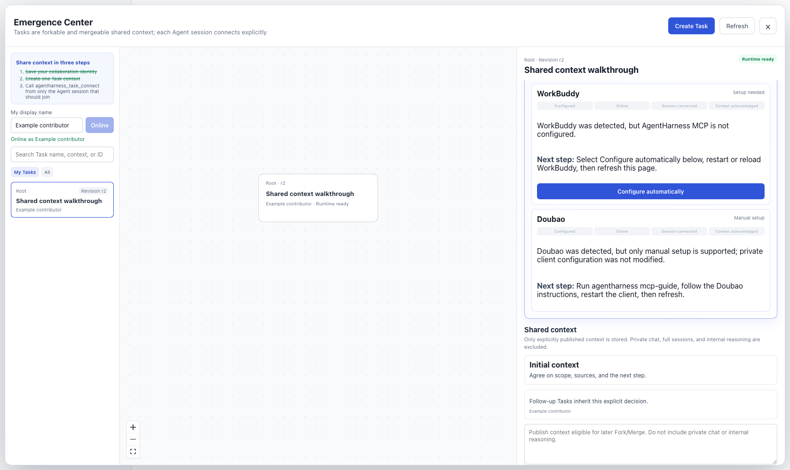

# AgentHarness

English | [中文](README.zh.md)

**Collaborative context engineering for people and agents.**

Work on one problem across separate agent sessions. AgentHarness gives each shared Task a place for goals, findings, and decisions: publish the context collaborators need, connect their sessions, and carry selected context into follow-up work.

[Try it](#run) · [User guide](docs/user/guide/index.md) · [Design white paper](docs/whitepaper.md) · [Contribute](CONTRIBUTING.md)



The collaboration center shows the Task's lineage, each client's connection guidance, and the context people have chosen to share.

## One task, several perspectives

When teammates work in separate agent sessions, findings and decisions can remain scattered across conversations. AgentHarness makes selected context available around a shared Task, with explicit publications and fixed source revisions.

For example, a team investigating a slow API can use this workflow:

| Step | What collaborators do | What carries forward |
| --- | --- | --- |
| Define the task | Record the goal, constraints, and starting references. | A common starting point. |
| Publish a finding | Add a concise finding and its source under **Shared context**. | An explicit contribution, attributed to its publisher. |
| Bring in another session | Connect a colleague's Codex, Cursor, or Claude session to the Task. | That session can receive the Task's shared context. |
| Explore alternatives | Fork Tasks for separate approaches; preview and select inherited publications. | Context from a fixed parent revision. |
| Bring findings together | Create a Merge Task from two or more Tasks. | Selected context with its source Tasks and revisions. |

Fork and Merge create new Tasks and preserve their parents. A Merge brings context together; collaborators still evaluate conflicting conclusions and manage code changes in their development tools. Private chats, full session histories, and internal reasoning are not published automatically.

<a id="run"></a>
## Try it

Use Node.js **22.19.x or a later 22.x release, or 24+**. On macOS/Linux, also install curl, tar, and sha256sum or shasum; Windows x64 needs PowerShell and tar. Then run:

```sh
npx --yes @sandboxbreak/agentharness
```

The installer downloads AgentHarness with its bundled DeepSeek Harness and portable Node runtime, starts the service, and opens the local app at `http://127.0.0.1:3080`. [GitHub Releases](https://github.com/Oklahomawhore/AgentHarness/releases) provides versioned installers and archives.

**You can create a Task without a model API key.** In the collaboration center that opens on startup:

1. Enter a collaboration display name and save it.
2. Choose **New task → New independent task**, then enter a name and initial shared context.
3. Publish a finding or decision under **Shared context**. Select the Task to see its revision, lineage, and published material.
4. Follow the Agent-session guidance to connect one specific session. Ask that session to call `agentharness_task_connect` for the Task. Each additional session joins separately.

Client MCP configuration prepares the connection. **Session connected** means an individual session joined; **Context acknowledged** means it received the Task revision on a subsequent MCP call.

To use the app's built-in model conversation, close the center, choose a local project folder as your Workspace, and activate the conversation input. If no model is usable, the API-key dialog asks for your own DeepSeek key. The key is stored in your local Harness home and is not bundled in the release.

The [user guide](docs/user/guide/index.md) covers service controls, MCP setup, and connecting teammates' installations. Separate machines need a configured collaboration cluster; joining a shared Task does not configure that network connection.

## What to expect

AgentHarness is a **developer preview**; compatibility-breaking changes are expected. You can use Tasks locally or collaborate between configured nodes. Task context consists of initial material, explicit publications, and selected inherited context. Tasks have no approval or completion workflow, and parent revisions stay fixed after creation.

The [design white paper](docs/whitepaper.md) explores the broader direction of collaborative context engineering. The [user guide](docs/user/guide/index.md) describes the available workflow; the [collaboration reference](packages/collaboration/README.md) explains its implementation.

## Project and upstream

AgentHarness is an independent project maintained by **Wangshu Zhu**, an algorithm engineer at a startup. **Neither the project nor its author is affiliated with or endorsed by DeepSeek.**

The project is built on [DeepSeek Harness](https://github.com/deepseek-ai/deepseek-harness) and [Cordis](https://github.com/cordiverse/cordis). It retains upstream package names and plugin architecture; [upstream provenance](UPSTREAM.md) records the pinned release and attribution. Model access uses your own credentials.

<a id="run-from-source"></a>
## Contribute and develop

Use the [development guide](docs/development.md) to run from source and the [contribution guide](CONTRIBUTING.md) for the branch and PR workflow. Reproducible examples of context handoffs, installation reports, and documentation improvements are useful contributions. Remove keys and private data from [issues](https://github.com/Oklahomawhore/AgentHarness/issues) and [pull requests](https://github.com/Oklahomawhore/AgentHarness/pulls). Agents should follow [AGENTS.md](AGENTS.md).

## License

[MIT](LICENSE) · AgentHarness copyright © 2026 **Wangshu Zhu**. Upstream and third-party notices are retained in [Third-Party Notices](THIRD_PARTY_NOTICES.md).
