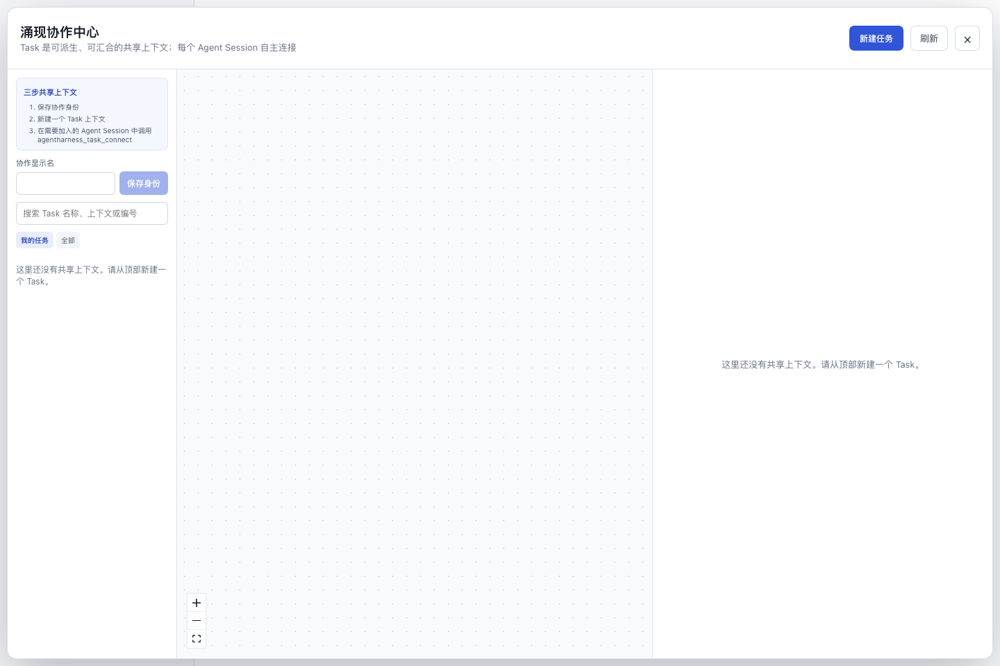
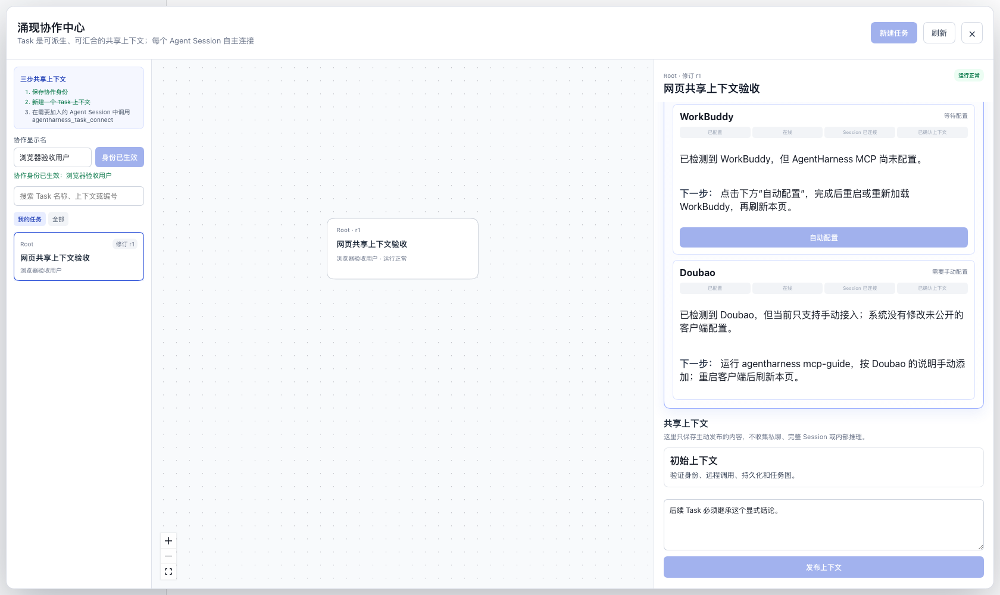

# AgentHarness

[English](README.md) | 中文


**给人与 Agent 一个共同做事的地方。** AgentHarness 启动后打开本地协作中心：你可以创建 Task，让各个 Agent Session 自主加入，并发布它们可以共享的上下文。Task 可以派生、汇合，创建时固定选中的来源上下文。每个 Task 背后有负责成员关系的 Room；界面以 Task 为中心。

<a id="run"></a>
## 一键体验

安装 [Node.js 22.19+ 或 24+](https://nodejs.org/)，运行下面这条命令。它会安装 AgentHarness、内含的 DeepSeek Harness 和便携 Node 运行时，然后在 `http://127.0.0.1:3080` 打开本地 Web 界面：

```sh
npx --yes https://github.com/Oklahomawhore/AgentHarness/releases/download/v0.2.1/agentharness-npm.tgz
```

首次发布 npm 包后，可以使用更短的 `npx --yes agentharness`。macOS/Linux 需要 curl、tar 和 sha256sum 或 shasum；Windows x64 需要 PowerShell 和 tar。

**应用打开时，协作中心已经展开。** 不填 API key 也能浏览界面、创建 Task。准备与模型对话时，先关闭协作中心，选择本机项目目录作为工作区，再点击对话输入区。如果尚无可用模型，此时才弹出 API key 配置；填写你自己的 DeepSeek key。密钥只保存在本机 Harness home，不进入发行包。



创建 Task 后，协作中心会展示任务谱系、Agent Session 指引与已发布的上下文：



1. 填写协作显示名并保存。
2. 点击**新建任务 → 新建独立任务**，填写 Task 名称和初始共享上下文。
3. 选中 Task，按照 Agent Session 指引操作。安装器会配置受支持的本地 MCP 客户端；每个 Codex、Cursor 或 Claude Session 都需要从各自的会话中主动加入。
4. 主动发布希望后续 Task 继承的决策。可以派生一个 Task，也可以汇合多个 Task。私聊和内部推理不会自动公开。

安装后可运行 `agentharness status`、`agentharness logs`、`agentharness stop` 管理进程。工作区选择、MCP 配置和多节点设置详见[用户指南](docs/user/guide/index.zh.md)。

## AgentHarness 用来做什么

AgentHarness 让分布在不同 Agent Session 中的协作者围绕同一个 Task 留下决策、来源和下一步行动。由人选择发布哪些上下文；私聊和内部推理不会自动共享。当前版本支持本地 Task 与已配置节点间的协作。更广泛的互操作仍是设计目标，详见[中英文白皮书](docs/whitepaper.zh.md)。

AgentHarness 是基于 [DeepSeek Harness](https://github.com/deepseek-ai/deepseek-harness) 和 [Cordis](https://github.com/cordiverse/cordis) 的独立开源发行版，保留上游 `@deepseek-ai/dsh-*` 包名和插件架构；源码固定在已发布的 `dsh-v0.1.5-rc.2` 候选版（[来源说明](UPSTREAM.zh.md)）。运行时包含火山引擎 Coding Plan endpoint，但不包含共享 API key。**目前是开发者预览版，未来可能有破坏兼容性的变更。**

<a id="run-from-source"></a>
## 参与和开发

分支流程见[贡献指南](CONTRIBUTING.zh.md)，从源码运行见[开发指南](docs/development.zh.md)。开发者可以将 `.env.example` 复制为 `.env`，填写自己的 key，然后运行 `pnpm start`。在 [Issue](https://github.com/Oklahomawhore/AgentHarness/issues) 和 [PR](https://github.com/Oklahomawhore/AgentHarness/pulls) 中请移除密钥及私人数据。Agent 应遵守 [AGENTS.md](AGENTS.md)。

## 许可证

[MIT](LICENSE) · AgentHarness 版权所有 © 2026 **Wangshu Zhu**。上游及第三方版权声明见 [Third-Party Notices](THIRD_PARTY_NOTICES.md)。
