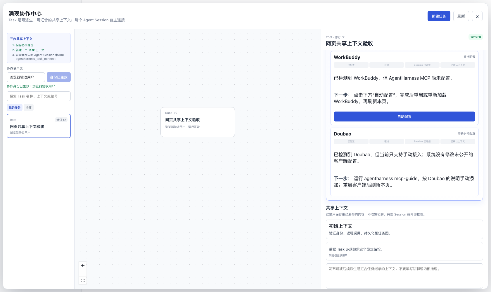

# AgentHarness

[English](README.md) | 中文

**面向人与 agent（智能体）的协作式上下文工程。**

让不同 agent 会话围绕同一个问题工作。AgentHarness 用共享 Task 组织目标、发现和决策：发布协作者需要的上下文，让各自的会话加入，再将选中的上下文带入后续工作。

[立即体验](#run) · [用户指南](docs/user/guide/index.zh.md) · [设计白皮书](docs/whitepaper.zh.md) · [参与贡献](CONTRIBUTING.zh.md)



协作中心展示 Task 谱系、各客户端的连接指引，以及参与者选择共享的上下文。

## 一件事，多种视角

团队成员在不同 agent 会话中工作时，发现和决策容易散落在各自的对话里。AgentHarness 围绕共享 Task 组织选中的上下文，通过主动发布和固定来源版本，让其他参与者接续工作。

以团队排查一个响应缓慢的 API 为例：

| 步骤 | 协作者做什么 | 保留下来的上下文 |
| --- | --- | --- |
| 明确任务 | 写下目标、约束和起始参考资料。 | 共同的起点。 |
| 发布发现 | 在**共享上下文**中写下简洁的发现及其来源。 | 标明发布者的明确贡献。 |
| 加入另一个会话 | 将同事的 Codex、Cursor 或 Claude 会话连接到 Task。 | 该会话可以接收 Task 的共享上下文。 |
| 探索不同方案 | 为不同方案派生 Task，预览并选择继承的发布内容。 | 固定在父 Task 某个版本的上下文。 |
| 汇集发现 | 从两个或更多 Task 创建一个汇合 Task。 | 选中的上下文及其来源 Task 和版本。 |

派生（Fork）和汇合（Merge）都会创建新 Task，保留父 Task。汇合将上下文放在一起；协作者仍需判断相互矛盾的结论，并在开发工具中管理代码变更。私聊、完整会话历史和内部推理不会自动公开。

<a id="run"></a>
## 立即体验

使用 Node.js **22.19.x 或更新的 22.x 版本，或 24+**。macOS/Linux 还需要 curl、tar 和 sha256sum 或 shasum；Windows x64 需要 PowerShell 和 tar。然后运行：

```sh
npx --yes @sandboxbreak/agentharness
```

安装器下载 AgentHarness 及其内含的 DeepSeek Harness 和便携 Node 运行时，启动服务，并在 `http://127.0.0.1:3080` 打开本地应用。[GitHub Releases](https://github.com/Oklahomawhore/AgentHarness/releases) 提供带版本的安装脚本与归档文件。

**创建 Task 无需模型 API key。** 在启动时展开的协作中心中：

1. 填写协作显示名并保存。
2. 点击**新建任务 → 新建独立任务**，填写名称和初始共享上下文。
3. 在**共享上下文**中发布一项发现或决策。选中 Task，即可查看版本、谱系和已发布的材料。
4. 按照 Agent Session 指引连接一个具体会话，让该会话为这个 Task 调用 `agentharness_task_connect`。其他会话需要分别加入。

客户端的 MCP 配置用于准备连接。**Session 已连接**表示一个具体会话已经加入；**上下文已确认**表示该会话在后续 MCP 调用中收到了 Task 版本。

使用应用内置的模型对话时，先关闭协作中心，选择本机项目目录作为工作区，再点击对话输入区。如果尚无可用模型，API key 对话框会要求填写你自己的 DeepSeek key。密钥保存在本机 Harness home 中，不包含在发行包里。

[用户指南](docs/user/guide/index.zh.md)介绍服务管理、MCP 配置，以及如何连接队友的安装实例。不同机器需要配置到同一个协作集群；加入共享 Task 不会自动完成这项网络配置。

## 使用范围

AgentHarness 处于**开发者预览阶段**，未来可能有破坏兼容性的变更。你可以在本地使用 Task，也可以在已配置的节点之间协作。Task 上下文包含初始材料、主动发布的内容，以及选中继承的上下文。Task 没有审批或完成流程，创建后固定所选父 Task 的版本。

[设计白皮书](docs/whitepaper.zh.md)讨论协作式上下文工程的更广泛方向。[用户指南](docs/user/guide/index.zh.md)描述可用流程，[协作参考文档](packages/collaboration/README.zh.md)解释具体实现。

## 项目与上游

AgentHarness 是由初创公司算法工程师 **Wangshu Zhu** 独立维护的项目。**本项目及作者均不隶属于 DeepSeek，也未获得 DeepSeek 的官方背书。**

项目基于 [DeepSeek Harness](https://github.com/deepseek-ai/deepseek-harness) 和 [Cordis](https://github.com/cordiverse/cordis) 构建，保留上游包名与插件架构；[上游来源说明](UPSTREAM.zh.md)记录固定的版本和归属信息。模型访问使用你自己的凭据。

<a id="run-from-source"></a>
## 参与和开发

从源码运行见[开发指南](docs/development.zh.md)，分支与 PR（Pull Request）流程见[贡献指南](CONTRIBUTING.zh.md)。欢迎提供可复现的上下文交接示例、安装问题报告，以及文档改进。在 [Issue](https://github.com/Oklahomawhore/AgentHarness/issues) 和 [PR](https://github.com/Oklahomawhore/AgentHarness/pulls) 中请移除密钥及私人数据。Agent 应遵守 [AGENTS.md](AGENTS.md)。

## 许可证

[MIT](LICENSE) · AgentHarness 版权所有 © 2026 **Wangshu Zhu**。上游及第三方版权声明见 [Third-Party Notices](THIRD_PARTY_NOTICES.md)。
